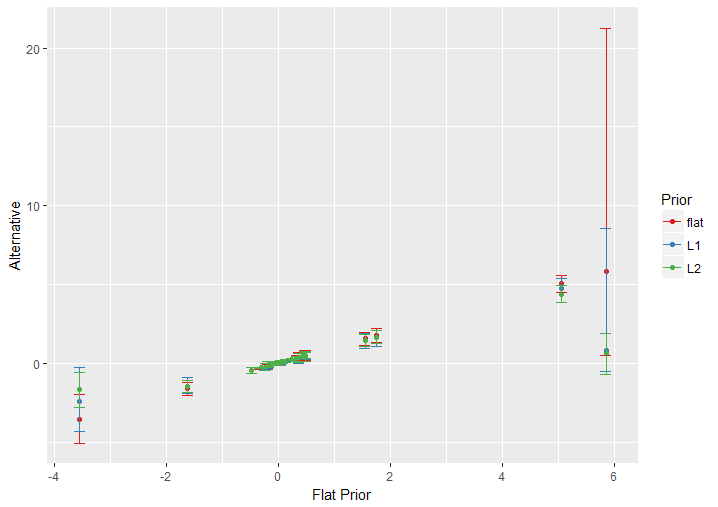

```{r setup, include=FALSE}
options(htmltools.dir.version = FALSE)
# find.image searches subdirectories for partial match of argument. Useful when some images are dynamically generated
find.image=function(name){grep(name,list.files(recursive = TRUE),value=TRUE)}

# Example of how to use find.image to display an image
#`)

```

#Data

<br>

Online News Popularity Data Set 

 + This dataset contains rougly 45 attributes about articles published by Mashable in a period of two years. The goal is to predict the number of shares in social networks (popularity).
 
 + Variables range from category (business, entertainment, lifestyle, etc), measures of the article's subjectivity and polarity, and the average word length.
 
 + We end up removing some variables that display multicollinearity, and we also scale the continuous variables.

---

#Data


A sample of a few rows and columns:

```{r, echo = F}
onp <- read.csv("onpex.csv",stringsAsFactors = F)
onp <- rbind( onp , rep(" ", 7) )
print(onp[ ,c(3,12,13,29, 40 , 47 , 45)], row.names = F)
```

--

<br>

 + Dataset has 39,644 samples. We will use a n=30,000 train / 9,644 test split.

 + There are 25 covariates, with $K=30$ estimated parameters, including the intercept.


---
# Goals


<br>

<br>


 + The goal is to find the attributes that can predict how sharable an article is.


--


 + We will utilize the Bayesian ordinal probit model.


--

 + We will test the robustness of our estimates for $\beta$ with three different priors on $\beta$: a flat prior, a Laplacian prior, and a Normal prior.


--

 + The Laplacian and Normal priors turn our regression into Bayesian versions of LASSO regression and ridge regression respectively, a purposeful choice as we have many covariates under consideration in our regression.
 
--

 + We will use out-of-sample testing to check our results.


---
# Methods

 + Rather than attempt to predict the given "shares" directly, we instead translate "shares" of the articles $i = 1,...,n$ into quintiles to form ordinal categories.

--

 + Again, this lends itself to ordinal probit regression, which can be more easily modeled in a Bayesian context through latent variables.


--

 + For this formulation, the latent variable $z_i$ of article $i$, $z \overset{iid}{\sim} N( x'_i \beta ,1)$

  + Where $x_i$ is the vector of predictive variables and $\beta$ is the vector of coeffcients we are ultimately interested in.
 
--

The observed response variable $y_i$, which quantile of shares does it attract, is:


$$y_i = \begin{cases} \hfil 1 &  \text{if  } \  \gamma_0 < z_i \leq \gamma_1 \\[.3 em] \hfil 2  & \text{if  } \ \gamma_1 < z_i \leq \gamma_2 \\[.3 em] & \hspace{11 mm} \vdots \\[.4 em] \hfil 5  & \text{if  } \ \gamma_4 < z_i \leq \gamma_5 \\ \end{cases}$$


Where $\gamma_0$ is $-\infty$, $\gamma_1$ is fixed at 0, and $\gamma_5$ is $\infty$

---

# Flat Prior

<br>

Likelihood


$$\begin{align*} \mathcal{L}(y|z,\gamma,\beta,X) & \propto \prod_{i=1}^{n} \left[ \ \sum_{j=1}^5 I_{ \{ \gamma_{j-1} < z_i \leq \gamma_j \} }  \ I_{\{y_i = j\}}\right] \exp\left[ -\cfrac{1}{2} \left(z_i - x'_i \beta \right)^2 \right] \\[.5em] & \propto  \left[ \ \prod_{i=1}^{n} \sum_{j=1}^5 I_{ \{ \gamma_{j-1} < z_i \leq \gamma_j \} }  \ I_{\{y_i = j\}}\right] \exp\left[ -\cfrac{1}{2} \left(z-X\beta\right)'\left(z-X\beta\right) \right] \\[1em] \end{align*}$$


<br>

--

Under the flat prior $\pi(\beta)\propto 1$, the posterior is unchanged.  

<br>

$$\begin{align*} P(z,\gamma,\beta|y,X) &  \propto  \left[ \ \prod_{i=1}^{n} \sum_{j=1}^5 I_{ \{ \gamma_{j-1} < z_i \leq \gamma_j \} }  \ I_{\{y_i = j\}}\right] \exp\left[ -\cfrac{1}{2} \left(z-X\beta\right)'\left(z-X\beta\right) \right] \end{align*}$$ 


---

# Flat Prior

We now derive the conditional for $\beta$:

$$\begin{align*} p(\beta|z,\gamma,X,y) & \propto \exp\left[-\cfrac{1}{2} \left( \beta'X'X\beta - 2\beta'X'X(X'X)^{-1}X'z \right) \right]\end{align*}$$

--

Which is the kernel of a normal distribution, so $$\begin{align*} \beta|z,\gamma,X,y \sim N\Big( (X'X)^{-1}X'z , (X'X)^{-1}  \Big)\end{align*}$$

<br>
--

The conditional for $\gamma_j$, where $j=2,3,4$:

$$\begin{align*} p(\gamma_j|z,\beta,X,y) & \propto \prod_{i=1}^n I_{ \{ \gamma_{j-1} < z_i \leq \gamma_j \} }  \ I_{\{y_i = j\}} + I_{ \{ \gamma_{j} < z_i \leq \gamma_{j+1} \} }  \ I_{\{y_i = j + 1 \}}\end{align*}$$
--

Which is a uniform distribution

$$\gamma_j|z,\beta,X,y \sim U\Big(\max\{\max\{z_i: y_i = j\}, \gamma_{j-1} \}, \min\{\min\{ z_i:y_i = j+1\}, \gamma_{j+1}\} \Big)$$


---

#Flat Prior


<br>

<br>

To find the conditionals for $z_i$, we must consider the separate cases of $y_i$

--

If $y_i = j$, the conditional for $z_i$ is:


$$\begin{align*} p( z |\gamma,\beta,X,y) & \propto  \exp\left[-\cfrac{1}{2}\left(z_i - x'_i\beta \right)^2\right]\end{align*}  I_{ \{ \gamma_{j-1} < z_i \leq \gamma_{j} \} }$$


Which is a truncated normal with mean $x'_i\beta$, variance 1, and truncated to be between $\gamma_{j-1}$ and $\gamma_j$.


---

#Flat Prior

We specifiy a Gibbs sampling scheme:


--

 1. For each $j = 2,...,J$ draw $\small\gamma_j^{(b)}$ from $$\scriptsize U\Big(\max\left\{\max\left\{z_i^{(b-1)}: y_i = j\right\}, \gamma_{j-1}^{(b-1)} \right\}, \min\left\{\min\left\{ z_i^{(b-1)}:y_i = j+1 \right\}, \gamma_{j+1}^{(b-1)} \right\} \Big)$$

--

 2. For each $j = 1,...,J$ draw $z_i^{(b)} | y_i = j$ from $$\small N\left( x'_i \beta^{(b-1)} , 1 \right) \text{, truncated at the left (right) by } \gamma_{j-1}^{(b-1)} \left( \gamma_{j}^{(b-1)}\right)$$

--

 3. Draw $\beta^{(b)}$ from 

$$\small N\left(  \left( X'X \right)^{-1} X'z^{(b)}  , \left( X'X  \right)^{-1} \right)$$


---

# Penalization

<br>

 + With a large number of predictors our estimates can be noisy.
 
 + We wish to perform regularization to give more stable estimates and perform shrinkage.
 
 + We will consider the Bayesian Lasso and a Ridge Regression in an attempt to produce better estimates.
 
 + Recall the Bayesian Lasso uses the double exponential prior and the Bayesian Ridge regression utilizes a normal prior.

---

# L1 LASSO

<br>

<br>

Likelihood


$$\begin{align*} \mathcal{L}(y|z,\gamma,\beta,X) & \propto \prod_{i=1}^{n} \left[ \ \sum_{j=1}^5 I_{ \{ \gamma_{j-1} < z_i \leq \gamma_j \} }  \ I_{\{y_i = j\}}\right] \exp\left[ -\cfrac{1}{2} \left(z_i - x'_i \beta \right)^2 \right] \\[.5em] & \propto  \left[ \ \prod_{i=1}^{n} \sum_{j=1}^5 I_{ \{ \gamma_{j-1} < z_i \leq \gamma_j \} }  \ I_{\{y_i = j\}}\right] \exp\left[ -\cfrac{1}{2} \left(z-X\beta\right)'\left(z-X\beta\right) \right] \\[1em] \end{align*}$$


<br>

---

# L1 LASSO

Posterior

 + Instead of applying the Laplacian prior to directly to the likelihood, we can express the Laplacian as a mixture model of normals with inverse gamma priors. 

--

 + Previously: $\beta_k \sim L(0 , \lambda^{-1})$
 
 
--
 
 + Now: $\beta_k \sim N\left(0 , \cfrac{4 \left(\lambda^{-1}\right)^2 }{\alpha_k} \right)$, where $\left(\lambda^{-1}\right)^2 \sim IG(a,b)$ and $\alpha_k \overset{iid}{\sim} IG\left(1,\frac{1}{2} \right)$

--

 + This allows us to utilize a Gibbs sampler

---

# L1 LASSO

<br>

Full Posterior

$$\begin{align*} P(z,\gamma,\beta,\alpha,\lambda|X,y) & \propto \mathcal{L}(y|z,\gamma,\beta,X) \pi(\beta|\lambda,\alpha)\pi(\lambda)\pi(\alpha)    \end{align*}$$ 
<br>

$$\begin{align*} & \propto  \left[ \ \prod_{i=1}^{n} \sum_{j=1}^5 I_{ \{ \gamma_{j-1} < z_i \leq \gamma_j \} }  \ I_{\{y_i = j\}}\right] \exp\left[ -\cfrac{1}{2} \left(z-X\beta\right)'\left(z-X\beta\right) \right] \left[\left(\lambda^{-1}\right)^2\right]^{-(a+1)} \cdot \\[.5em] & \hspace{10 mm} \exp\left(-\cfrac{b}{ \ \left(\lambda^{-1}\right)^2 \ }\right) \prod_{k=1}^K \left( \cfrac{\alpha_k}{\left(\lambda^{-1}\right)^2} \right)^\frac{1}{2} \exp\left[-\cfrac{\alpha_k \ \beta_k^2}{8\left(\lambda^{-1}\right)^2} \right] \alpha_k^{-2} \exp\left(-\cfrac{1}{2\alpha_k}\right) \end{align*}$$


---

# L1 LASSO

<br>

The full conditionals of $z$ and $\gamma_j$ are not affected by the new prior.

--

Recall : 

--

If $y_i = j$, the conditional for $z_i$ is:


$$\begin{align*} p( z| \gamma,\beta,\alpha,\lambda,X,y ) & \propto  \exp\left[-\cfrac{1}{2}\left(z_i - x'_i\beta \right)^2\right]\end{align*}  I_{ \{ \gamma_{j-1} < z_i \leq \gamma_{j} \} }$$

A truncated normal with mean $x'_i\beta$, variance 1, and truncated to be between $\gamma_{j-1}$ and $\gamma_j$.


--


The conditional for $\gamma_j$ is:

$$\gamma_j|z,\beta,X,y \sim U\Big(\max\{\max\{z_i: y_i = j\}, \gamma_{j-1} \}, \min\{\min\{ z_i:y_i = j+1\}, \gamma_{j+1}\}\Big)$$
---

# L1 LASSO

<br>

The conditional for $\beta$ is:

$$\scriptsize \begin{align*} P(\beta|\text{rest}) & \propto \exp\left\{-\cfrac{1}{2} \left[ \left( \beta  - \left( X'X + \frac{\lambda^2}{4}\bf{D}_\alpha \right) X'Z   \right)'\left( X'X + \frac{\lambda^2}{4}\bf{D}_\alpha \right) \left( \beta  - \left( X'X + \frac{\lambda^2}{4}\bf{D}_\alpha \right) X'Z   \right) \right]\right\}\end{align*}$$ 

Where $\bf{D}_\alpha$ $= \text{diag}(\alpha_1, ...,\alpha_k)$

--


<br>

We recognize this as the kernel of a normal distribution, so

$$\small  \beta|\text{rest} \sim N\left( \left( X'X + \frac{\lambda^2}{4}\bf{D}_\alpha \right)^{-1} X'z  , \left( X'X + \frac{\lambda^2}{4}\bf{D}_\alpha \right)^{-1} \right)$$

---

# L1 LASSO

<br>

The conditional on $\lambda$ is:

$$P(\lambda|z, \gamma,\beta,\alpha,X,y) \propto \left(\lambda^2\right)^{\frac{K}{2}+a+1} \exp\left[-\lambda^2 \left(b+ \frac{1}{8} \sum_{k=1}^K \alpha_k\beta_k^2 \right)\right] $$
--

Which is identifiable as the kernel of a Gamma.

$$\lambda|z, \gamma,\beta,\alpha,X,y \sim Gamma\left( \frac{K}{2} + a + 2, b+ \frac{1}{8} \sum_{k=1}^K \alpha_k\beta_k^2 \right)$$

---


# L1 LASSO

<br>

Finally, the conditional for $\alpha_p$


$$P(\alpha_p |\lambda,z, \gamma,\beta,\alpha_{p\neq k},X,y) \propto \alpha_p^{-\frac{3}{2}} \exp\left[ -\cfrac{1}{2} \cfrac{\left( \alpha_p - \frac{2\lambda^{-1}}{|\beta_p|} \right)^2}{\alpha_p\left(\frac{2\lambda^{-1}}{|\beta_p|}\right)^2} \right]$$


Which is a kernel of the inverse Gaussian.

$$\alpha_p |\lambda,z, \gamma,\beta,\alpha_{p\neq k},X,y \sim N^{-1}\left(  \frac{ 2  \lambda^{-1}  }{|\beta_k|} , 1 \right)$$

---

# L1 LASSO

After deriving the conditionals we can set up a Gibbs sampler without a M-H step.

--

1. For each $j = 2,...,J$ draw $\small\gamma_j^{(b)}$ from $$\scriptsize U\Big(\max\left\{\max\left\{z_i^{(b-1)}: y_i = j\right\}, \gamma_{j-1}^{(b-1)} \right\}, \min\left\{\min\left\{ z_i^{(b-1)}:y_i = j+1 \right\}, \gamma_{j+1}^{(b-1)} \right\} \Big)$$

--

1. For each $j = 1,...,J$ draw $z_i^{(b)} | y_i = j$ from $$\small N\left( x'_i \beta^{(b-1)} , 1 \right) \text{, truncated at the left (right) by } \gamma_{j-1}^{(b-1)} \left( \gamma_{j}^{(b-1)}\right)$$

--

1. Draw $\lambda^{2^{(b)}}$ from $Gamma\left( \frac{K}{2} + a + 2, b+ \frac{1}{8} \sum_{k=1}^K \alpha_k^{(b-1)} \beta_k^{2^{(b-1)}} \right)$

--

1. For each $k = 1,...,K$ draw $\alpha_k^{(b)}$ from $N^{-1}\left( \frac{ 2  \lambda^{-1^{(b)}}  }{|\beta_k^{(b-1)}|} , 1\right)$

--

1. Draw $\beta^{(b)}$ from 

$$\small N\left( \left( X'X + \frac{\lambda^{2^{(b)}}}{4}\bf{D}^{(b)}_\alpha \right)^{-1} X'z^{(b)}  , \left( X'X + \frac{\lambda^{2^{(b)}}}{4}\bf{D}^{(b)}_\alpha \right)^{-1} \right)$$
---


# L2 Ridge regression

<br>

<br>

Lastly, we consider the Bayesian Ridge regression, which is $\beta_k \sim N\left(0,\lambda^{-1}\right)$. Thus we have:
 
$$\begin{align*}\pi\left(\beta_1,...,\beta_K\right) \propto \prod_{k=1}^K \lambda^{\frac{1}{2}} \ \exp\left[-\cfrac{\lambda}{2} \beta_k^2\right] \\[.5em] \propto \lambda^\frac{K}{2} \exp\left[-\cfrac{\lambda}{2} \sum_{k=1}^K \beta_k^2 \right] \end{align*}$$

--

With Jeffrey's prior as the hyper-prior:

$$\pi(\lambda) \propto \lambda^{-1}$$
---
# L2 Ridge regression

Same likelihood as before.

This leads to the posterior:

<br>

$$\small \begin{align*}P(\beta,\lambda,z|y) & \propto \mathcal{L}(y|\beta,\lambda,z)\pi(\beta|\lambda)\pi(\lambda)\\[.5em] & \propto  \left[ \ \prod_{i=1}^{n} \sum_{j=1}^5 I_{ \{ \gamma_{j-1} < z_i \leq \gamma_j \} }  \ I_{\{y_i = j\}}\right] \exp\left[ -\cfrac{1}{2} \left(z-X\beta\right)'\left(z-X\beta\right) \right]  \cdot  \\[.5em] & \hspace{10mm} \exp\left[-\cfrac{1}{2} (z-X\beta)'(z-X\beta) \right]  \lambda^\frac{K}{2} \exp\left[-\cfrac{\lambda}{2} \sum_{k=1}^K \beta_k^2 \right]\lambda^{-1}\\[.5em] & \propto \left[ \ \prod_{i=1}^{n} \sum_{j=1}^5 I_{ \{ \gamma_{j-1} < z_i \leq \gamma_j \} }  \ I_{\{y_i = j\}}\right] \lambda^{\frac{K}{2}-1} \exp\left[-\cfrac{1}{2} \Big( (z-X\beta)'(z-X\beta) + \lambda \beta'\beta \Big)\right]\end{align*}$$

---
# L2 Ridge regression


Thus the full conditional on $\lambda$ is:

$$\small P(\lambda|\text{rest}) \propto \lambda^{\frac{K}{2}-1} \exp\left[-\cfrac{\lambda}{2} \  \beta'\beta\right]$$

--

Which is recognizable as a $\small Gamma\left(\cfrac{K}{2}, \cfrac{1}{2} \beta'\beta \right)$

--

<br>

The conditional of $\beta$ is:

$$\small P(\beta|\text{rest}) \propto \exp\left[-\cfrac{1}{2}\left( \beta'(X'X+\lambda I_K)\beta - 2\beta(X'X+\lambda I_K)(X'X+\lambda I_K)^{-1}X'z\right) \right]$$
--

Which is the kernel of a multivariate normal random variable with distribution $$\beta|\text{rest} \sim N\left((X'X+\lambda I_K)^{-1}X'z, (X'X+\lambda I_K)^{-1} \right)$$

---
# L2 Ridge regression

<br>

The full conditionals of $z$ and $\gamma_j$ are not affected by the new prior.

--

Recall : 


If $y_i = j$, the conditional for $z_i$ is:


$$\begin{align*} p( z| \text{rest} ) & \propto  \exp\left[-\cfrac{1}{2}\left(z_i - x'_i\beta \right)^2\right]\end{align*}  I_{ \{ \gamma_{j-1} < z_i \leq \gamma_{j} \} }$$

A truncated normal with mean $x'_i\beta$, variance 1, and truncated to be between $\gamma_{j-1}$ and $\gamma_j$.


--


The conditional for $\gamma_j$ is:

$$\gamma_j|\text{rest} \sim U\Big(\max\{\max\{z_i: y_i = j\}, \gamma_{j-1} \}, \min\{\min\{ z_i:y_i = j+1, \gamma_{j+1}\}\}\Big)$$
---
# L2 Ridge regression

We finally specifiy a Gibbs sampling scheme


--

1. For each $j = 2,...,J$ draw $\small\gamma_j^{(b)}$ from $$\scriptsize U\Big(\max\left\{\max\left\{z_i^{(b-1)}: y_i = j\right\}, \gamma_{j-1}^{(b-1)} \right\}, \min\left\{\min\left\{ z_i^{(b-1)}:y_i = j+1 \right\}, \gamma_{j+1}^{(b-1)} \right\} \Big)$$

--

1. For each $j = 1,...,J$ draw $z_i^{(b)} | y_i = j$ from $$\small N\left( x'_i \beta^{(b-1)} , 1 \right) \text{, truncated at the left (right) by } \gamma_{j-1}^{(b-1)} \left( \gamma_{j}^{(b-1)}\right)$$

--

1. Draw $\lambda^{(b)}$ from $Gamma\left( \frac{K}{2} , \frac{1}{2}   \beta'^{(b-1)}   \beta^{(b-1)} \right)$

--

1. Draw $\beta^{(b)}$ from 

$$\small N\left( \left( X'X + \lambda^{(b)} I_k \right)^{-1} X'z^{(b)}  , \left( X'X + \lambda^{(b)} I_k \right)^{-1} \right)$$


---

# Results

+ We sample using the data in a training set consisting of 30,000 datapoints.

--

+ The parameters of interest are the coeffcients of the regression, $\beta$, and the thresholds for the categories, $\gamma$.

--

+ Our estimates of some of the parameters $\beta$ clearly are affected by the prior:

.center[]


---

# Results

The variables that are associated with increased sharability are `kw_avg_avg` (average shares of the average keyword),
`num_hrefs` (number of links), `self_reference_avg_sharess` (average shares of referenced articles in Mashable),
while `global_rate_negative_words` and `num_self_hrefs` (number of links to other articles published by Mashable) is associated with less shares.


This suggests the topic is more important than the style, except that Mashable audiences are not looking for negative articles.

--

The flat prior also does worse than random guessing in an out-of-sample test, while the Bayesian LASSO and ridge models do marginally better. 


```{r, echo = F}
suppressWarnings(require(knitr,quietly = TRUE))
suppressWarnings(require(kableExtra,quietly = TRUE))

text_tbl <- data.frame( c("Flat Prior", "Laplacian Prior","Normal Prior" ) ,c(0.180,0.224,0.222 ))	
colnames(text_tbl) <- c("Prior","Accuracy")

kable(text_tbl,align=c( rep('c',times=2) ) ,
     escape = FALSE,
     col.names = c("Prior","Accuracy") )    %>%
 kable_styling(full_width = F, font_size = 18) %>%
 column_spec(1,width = "10em", bold = T ) %>%
 column_spec(2, width = "10em", bold = T   )  %>%
 row_spec(1,  background =  "#f8f0e8")%>%
 row_spec(2,  background = "#e9dfd1") %>%
 row_spec(0,  background = "#c2a25a")%>%
 row_spec(3,  background =  "#f8f0e8")

```

--

In all three models, the predictions are mostly 5's, showing that our models tend to over-predict sharability.

---
# Results
.center[Confusion Matrix for Flat Prior]
```{r, echo = F}
suppressWarnings(require(knitr,quietly = TRUE))
suppressWarnings(require(kableExtra,quietly = TRUE))
fp <- as.data.frame( matrix( NA, 5 ,5  ) )

fp[1,] <- c(1 , 10 , 14 , 23 , 1893)
	fp[2,] <-	c(2 , 11 , 17 , 22 , 2144)
fp[3,] <-		c(3 , 15 , 11 , 17 , 1836)
	fp[4,] <-	c(4 ,  4 , 16 , 29 , 1835)
	fp[5,] <-	c(5 ,  4 , 16 , 42 , 1685)

colnames(fp) <- c("Truth", "Estimated 2", "Estimated 3", 
	"Estimated 4" , "Estimated 5")

text_tbl <- fp
colnames(text_tbl) <- c("Truth", "Estimated 2", "Estimated 3", 
	"Estimated 4" , "Estimated 5")

kable(text_tbl,align=c( rep('c',times=5) ) ,
     escape = FALSE,
     col.names = c("Truth", "Estimated 2", "Estimated 3", "Estimated 4" , "Estimated 5") )    %>%
 kable_styling(full_width = F, font_size = 14) %>%
 column_spec(1,width = "10em", bold = F ) %>%
 column_spec(2, width = "10em", bold = F   )  %>%
   column_spec(3, width = "10em", bold = F   )  %>%
 column_spec(4, width = "10em", bold = F   )  %>%
 column_spec(5, width = "10em", bold = F   )  %>%
 row_spec(0,  background = "#c2a25a")%>%
 row_spec(1,  background =  "#f8f0e8")%>%
 row_spec(2,  background = "#e9dfd1") %>%
 row_spec(3,  background =  "#f8f0e8") %>%
 row_spec(4,  background = "#e9dfd1") %>%
 row_spec(5,  background =  "#f8f0e8")

```
.center[Confusion Matrix for L1 Prior]
```{r, echo = F}
suppressWarnings(require(knitr,quietly = TRUE))
suppressWarnings(require(kableExtra,quietly = TRUE))
fp <- as.data.frame( matrix( NA, 5 ,5  ) )

fp[1,] <- c(1 , 116 , 931 , 288 , 605)
	fp[2,] <-	c(2 , 94 , 839 , 376 , 885)
fp[3,] <-		c(3 , 51 , 504 , 395 , 929)
	fp[4,] <-	c(4 , 32 , 379 , 406 , 1067)
	fp[5,] <-	c(5 , 29 , 263 , 297 , 1158)

text_tbl <- fp

kable(text_tbl,align=c( rep('c',times=5) ) ,
     escape = FALSE, col.names = NULL)    %>%
 kable_styling(full_width = F, font_size = 14) %>%
 column_spec(1,width = "10em", bold = F ) %>%
 column_spec(2, width = "10em", bold = F   )  %>%
   column_spec(3, width = "10em", bold = F   )  %>%
 column_spec(4, width = "10em", bold = F   )  %>%
 column_spec(5, width = "10em", bold = F   )  %>%
 row_spec(1,  background =  "#f8f0e8")%>%
 row_spec(2,  background = "#e9dfd1") %>%
 row_spec(3,  background =  "#f8f0e8") %>%
 row_spec(4,  background = "#e9dfd1") %>%
 row_spec(5,  background =  "#f8f0e8")

```
.center[Confusion Matrix for L2 Prior]
```{r, echo = F}
suppressWarnings(require(knitr,quietly = TRUE))
suppressWarnings(require(kableExtra,quietly = TRUE))
fp <- as.data.frame( matrix( NA, 5 ,5  ) )


fp[1,] <- c(1 , 31 , 928 , 806, 175)
	fp[2,] <-	c(2 , 18 , 822 , 1024 , 330)
fp[3,] <-		c(3 , 22 , 475 , 969 , 413)
	fp[4,] <-	c(4 , 7 , 364 , 992 , 521)
	fp[5,] <-	c(5 , 8 , 271, 811 , 657)

text_tbl <- fp

kable(text_tbl,align=c( rep('c',times=5) ) ,
     escape = FALSE, col.names = NULL)    %>%
 kable_styling(full_width = F, font_size = 14) %>%
 column_spec(1,width = "10em", bold = F ) %>%
 column_spec(2, width = "10em", bold = F   )  %>%
   column_spec(3, width = "10em", bold = F   )  %>%
 column_spec(4, width = "10em", bold = F   )  %>%
 column_spec(5, width = "10em", bold = F   )  %>%
 row_spec(1,  background =  "#f8f0e8")%>%
 row_spec(2,  background = "#e9dfd1") %>%
 row_spec(3,  background =  "#f8f0e8") %>%
 row_spec(4,  background = "#e9dfd1") %>%
 row_spec(5,  background =  "#f8f0e8")


```